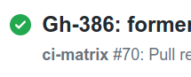
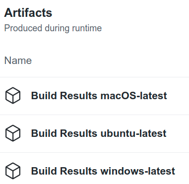
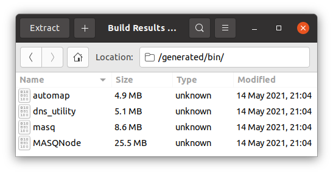

# MASQ Node 

<div align="center">


[](https://github.com/MASQ-Project/Node/releases/latest)
[](https://discord.gg/masq)

</div>

MASQ Node combines the benefits of VPN and Tor technology, to create superior next-generation privacy software, where 
users are rewarded for supporting an uncensored, global Web.  Users gain privacy and anonymity, while helping promote 
Internet Freedom.

## Purpose
**MASQ Node** forms the foundation of the MASQ Network.

The MASQ Network is an open-source decentralized mesh-network (dMN) that allows any user to allocate spare computing resources to make the Internet
a free and fair place for the entire world. It is a worldwide collection of Nodes that securely delivers content without
the need of a VPN or Tor.

Because there's no single authority delivering or monitoring content, censorship and geo-restricted sites won't be an
issue on the MASQ Network. It doesn't matter where you live or what content you're accessing, everyone in the world
sees the exact same content.

MASQ Node software is what the average user runs to earn $MASQ utility tokens and dedicate some of their computers' 
resources toward the Network - users can be rewarded with $MASQ for each time they serve content.

MASQ Nodes work together through the mesh network to relay digital content.
When a user requests a site, Nodes use a routing algorithm to find the most expedient and secure way to get the
information to that user. Multiple Nodes work together to route a single request in order to maintain a necessary level of
anonymity.

__Important Note:__ Please remember that at the moment the MASQ Node is in development and is not clandestine. Your
traffic can't be decrypted, and it is difficult to trace to you; but it is currently very easy for someone sniffing
your Internet connection to tell that you're using some form of Peer networking. Please don't use it for any kind of sensitive traffic at this 
stage - MASQ Network and it's developers are not responsible for any activity, or loss incurred, while using this beta software.

## Source
The MASQ project was forked from Substratum's Node project in order to carry on development after Substratum ceased 
operations in October of 2019. In 2021, Substratum's Node repositories were removed from GitHub, so the fork link
with MASQ was broken, but all credit for the original idea, the original design, and the first two years of MASQ's
development belongs to Substratum. 

## Running the MASQ Node

### MASQ Node Knowledge Base
A [Knowledge Base](https://docs.masq.ai/masq) and testing resources are being refined for users with various 
levels of technical ability.

There you can find further information, guides and configuration examples for running MASQ Node from:
- [MASQ Browser](https://masqbrowser.com)
- CLI
- Docker image

If you are interested in testing stages, speak to the team in the official [Discord channel](https://discord.gg/masq)

### MASQ Node Component README.md files
To help navigate the codebase, here are the README.md links for all documented components

- [Blockchain-Service-URL](https://github.com/MASQ-Project/Node/blob/master/node/docs/Blockchain-Service.md)
- [sub_lib](https://github.com/MASQ-Project/Node/blob/master/node/src/sub_lib/README.md)
- [proxy_server](https://github.com/MASQ-Project/Node/blob/master/node/src/proxy_server/README.md)
- [test_utils](https://github.com/MASQ-Project/Node/blob/master/node/src/test_utils/README.md)
- [ui_gateway](https://github.com/MASQ-Project/Node/blob/master/node/src/ui_gateway/README.md)
- [accountant](https://github.com/MASQ-Project/Node/blob/master/node/src/accountant/README.md)
- [proxy_client](https://github.com/MASQ-Project/Node/blob/master/node/src/proxy_client/README.md)
- [entry_dns](https://github.com/MASQ-Project/Node/blob/master/node/src/entry_dns/README.md)
- [hopper](https://github.com/MASQ-Project/Node/blob/master/node/src/hopper/README.md)
- [neighborhood](https://github.com/MASQ-Project/Node/blob/master/node/src/neighborhood/README.md)
- [multinode_integration_tests](https://github.com/MASQ-Project/Node/blob/master/multinode_integration_tests/tests/README.md)

### Downloading Official Releases

Releases will appear on our GitHub page - click on the badge above for the latest stable beta build, or go to our [Releases page](https://github.com/MASQ-Project/Node/releases/latest)

### Downloading the Latest Build

If you want to try out the latest build, go to
[our GitHub Actions continuous integration page](https://github.com/MASQ-Project/Node/actions) to see a list of builds.
Look for the latest (uppermost) successful build: it'll have a white checkmark in a green circle next to it.



Click on that link and scroll to the end of the page. You'll see a set of three artifact packages, one for each platform
MASQ supports.



Click the one that matches your platform; your browser will download a `.zip` file. Inside the `.zip` file are many
things useful to developers, but you'll be interested in the executable binaries in `/generated/bin`.



Make a directory somewhere on your system from which you'll run MASQ. You'll want to extract one or more files from
`/generated/bin` in the `.zip` file into that directory.

The most important file is `MASQNode`, or `MASQNode.exe` if you're using Windows. Definitely extract that one. It
contains the code for both the MASQ Node and the MASQ Daemon.

If you're using a graphical user interface for MASQ, that's all you'll need. If you're not, you'll probably also want
`masq`, which is a command-line user interface.

If the regular network-proxy setup doesn't work for you, you might want `dns_utility` as well to make it easy to
subvert your system's DNS configuration.

Finally, `automap` is a test utility used to check MASQ's automatic firewall penetration functionality against your
particular router. Unless you've volunteered to help the MASQ dev team run tests, you won't need this.

### Running from the Command Line

These instructions assume you have the MASQ Node executable but not the MASQ GUI. (If you do, consult the GUI
documentation about starting the Node on our [Testing Guides](https://docs.masq.ai/testing-guide)) You'll want to run the MASQ programs from wherever you expanded the
`/generated/bin` path from the `.zip` file you downloaded.

There are a number of ways to run the Node, but the way you'll probably want to use is to make sure the MASQ Daemon
is started first. If the Daemon is not running in the background already, open a terminal window and start it by typing

`$ sudo nohup ./MASQNode --initialization &`

if you're working in Linux or macOS, or

`$ start /b MASQNode --initialization`

if you're using Windows.

The Daemon's responsibility is to configure and start the Node. When it comes up, it sets up an initialization area
that contains configuration data for the Node: some of it defaulted, some of it loaded from the environment, some
loaded from a configuration file, if present, and the rest of it uninitialized. Before the Node is started, the
configuration data in the Daemon's initialization area should be adjusted so that the Node has what it needs when it
comes up.

If you have no GUI, the simplest way to do this is with the `masq` command-line user interface. Once you have the 
Daemon running, type

`$ masq`

at a handy command prompt. To learn how to use `masq` to set up and start the Node, type `help` at the `masq>` prompt,
and pay special attention to the `setup` and `start` commands.

If this is the first time you're starting the Node, you may also be interested in `set-password`, `create-wallets`, and
`generate-wallets`.

#### Supplying Configuration To MASQ Daemon

There are four ways to get configuration information into the initialization area of the MASQ Daemon on startup. 
In decreasing level of priority, these are:

1. `masq`
2. the Daemon's shell environment
3. a configuration file
4. defaults

Any piece of configuration information can be provided through any of these channels, with one exception: the path to
the configuration file cannot be taken from the configuration file. (It can be provided there, but it will never be
taken from there.) Configuration information provided in the configuration file will supersede defaults, information 
provided in the environment will supersede conflicting information provided in the configuration file, and information 
provided via the UI will supersede conflicting information from all the other sources.

##### UI

This is the easiest. In this file, our documentation of the configuration options shows you how to provide them to 
`masq` on the command line, either in interactive mode or in noninteractive mode. Keep in mind, though, that command 
lines tend to be preserved by the operating system for display to users who want to see process lists. Therefore, the
command line may not be the best place to specify sensitive or secret configuration information. (Nothing prevents you 
from doing this, though, so be careful.)

##### Shell Environment

If you see that the UI accepts a command such as `setup --clandestine-port 1234`, then you can supply that same
parameter in the environment by setting the `MASQ_CLANDESTINE_PORT` environment variable to `1234`. Note that you need
to remove the initial `--` prefix, convert the name to all uppercase, change hyphens to underscores, and add a `MASQ_` 
prefix to namespace the parameter against other applications that might look for a similar variable.

##### Configuration File

The configuration file, by default, resides in the data directory (see the `--data-directory` parameter for further
information) and is named `config.toml`. If you leave the configuration file unspecified, this is where MASQ Node
will look for it. If it's found, it will be used; if it's not, MASQ Node will act as though it had been found but empty.
But if you want to use a different file, specify it either as `--config-file` in the Daemon setup or as `MASQ_CONFIG_FILE`
in the environment. If you specify a relative filename, MASQ Node will look for the configuration file in the data
directory; if you specify an absolute filename, MASQ Node will not use the data directory to find the configuration
file.

The configuration file should be in TOML format. TOML is a competitor to other formats like JSON and YAML, but the
MASQ Node uses only scalar settings, not arrays or tables. If you see that Daemon setup accepts a command such
as `setup --clandestine-port 1234`, then you can supply that same parameter in the configuration file by adding the
following line to it:

```
clandestine-port = "1234"
```

Note that you need to remove the initial `--` prefix. All the configuration parameters will work if you supply their
values as double-quoted strings, but if they're numeric values, you can supply them numerically as well--for example,

```
clandestine-port = 1234
```

Keep in mind that a configuration file is persistent information: anyone who has or can gain read access to the file
can read whatever's in it, whether MASQ Node is running or not. Therefore, the configuration file may not be the 
best place to specify sensitive or secret configuration information. (Nothing prevents you from doing this, though, so 
be careful.)

#### Running a Decentralized MASQ Node Locally

##### Wallets

In order to run decentralized, MASQ Node needs at least an earning wallet (an Ethereum wallet into which other Nodes
will make payments for the services your Node provides). If you plan to use your Node to consume data with a browser
or other network application, it will also need to be configured with a funded consuming wallet (an Ethereum wallet
from which it will make payments for the services other Nodes provide). If you want, you can use the same wallet for
both earning and consuming, although this will allow an attacker to connect your network-forming Gossip traffic with your
data traffic, if he wants.

MASQ only ever has to put money into your earning wallet, which means the Node only has to know its address. However,
MASQ needs to pay money out of your consuming wallet; therefore the Node needs to know more about that one. Currently,
we use the mnemonic seed, an optional "25th word" that serves the purpose of a password, and the derivation path.

If you route other people's traffic without having an earning wallet set up, a default earning wallet will be
used, in which case the funds you earn will go to MASQ instead of to you: so unless you're in a philanthropic mood,
you should be sure to set up or specify your earning wallet before you route data.

##### Password

The Node keeps a database on disk where it stores various things, like persistent configuration data and accounting
information.  In some cases, this information is sensitive, and if an attacker confiscated your computer and found
the sensitive data, you or others could be put at risk. Therefore, all the security-sensitive data in the database is
encrypted with a symmetric key. We call that key a password, and you're required to set it before you store any
sensitive data in the database. There are no rules for how long the password must be or what it must contain--security
of your data is your responsibility, not ours--but it needs to be present so that the database can be properly encrypted
with it.

MASQ never stores the password anywhere on disk, only in memory; so A) you'll need to supply the password every time
the Node starts, B) no one can tell you the password if you forget it, and C) forgetting it will mean that your
database is useless, and you'll have to start it over.

##### Interactive `masq` vs Noninteractive `masq`

The `masq` command-line interface can run two ways. If you just type

```
$ ./masq
```

at a command prompt, you'll be shown a `masq>` prompt, and the system will await a series of `masq` commands from you.
But if you type something like

```
$ ./masq setup --log-level debug --clandestine-port 1234
```

then `masq` will start up, execute the command you gave it, and immediately terminate.

This way, you can use interactive `masq` to give an impromptu series of commands to the Daemon and/or the Node, or you
can write shell scripts to control the Daemon and/or the Node for special purposes, with those scripts containing
noninteractive `masq` commands.

##### Daemon vs. Node

The MASQ Daemon and the MASQ Node are two different programs that share the same binary. If you start that binary with
the `--initialization` parameter, it will become the Daemon; if you start it without the `--initialization` parameter,
it will become the Node.

MASQ is designed to be very difficult to hack, but it's intended to go up against government-level attackers, so there's
always the possibility that they could have the funding to do something we didn't anticipate. If an attacker figures out
how to hack into a computer running MASQ, we think it's very important that at least he doesn't find himself hacked
into a process running with administrative privilege.

Also, it's important that the user interface, whether command-line or graphical, be able to direct the Node to start
without having administrative privilege. However, because of the network ports the Node has to initialize, it must at
least start up with administrative privilege. It drops all special privileges before it reads any data from the network,
though, so any attacker who manages to hack it over the network won't see those special privileges.

These two requirements led to the development of the MASQ Daemon. The Daemon should start up with administrative
privilege at system-boot time, and keep running--with that privilege--until the computer shuts down. In return for
being a long-running privileged process, the Daemon is forbidden from A) accessing the network in any way, and B)
communicating with the Node in any way other than starting its process. As long as these limitations are respected,
even someone who successfully hacks into the Node will not be able to hack into the privileged Daemon.

When the user interface (whether command-line or graphical) starts up, it connects first to the Daemon. There is a
set of commands the UI can use to communicate with the Daemon, but this set is comparatively small. As long as the
UI issues commands from that set, it will stay connected to the Daemon. At some point, the UI will probably issue
a command the Daemon doesn't understand - if the Node is running then the Daemon will instruct the UI to
drop its Daemon connection, create a new connection to the Node instead, and re-issue the unrecognized command so that
the Node can execute it.

Thereafter, the UI will be connected to the Node. It will not connect again to the Daemon unless the Node shuts down
or crashes; then the UI will fall back to the Daemon (if it's still running) or exit (if it's not).

##### Handy `masq` Subcommands

`masq` has quite a few subcommands that you can use, both interactively and noninteractively. The best way to find
out about these subcommands is to type

`$ ./masq --help`

noninteractively at a shell-command prompt, or

`masq> help`

interactively at a `masq` prompt.

##### Neighbors

If you're starting the very first MASQ Node in a MASQ network, then you don't have to tell your Node about
any preexisting network; instead, other people who want to join that MASQ Network will have to tell their Nodes
about your Node, which means you'll need to give them your Node descriptor.

Otherwise, you'll need to specify `--neighbors` as part of your `masq setup` so that your Node will know how to join 
the network that is already in place.

However, if your machine has already recently been on the MASQ Network, and you're starting the Node up again, there's 
a chance that at least some of the Nodes that were recently your neighbors are still up and can be recontacted; in that 
case, the Daemon will read the Node descriptors of your former neighbors out of the database and pre-populate the
`--neighbors` setup with them, and you might not have to enter anything manually.

##### Enabling Contact

In order to run decentralized, the MASQ Node _must_ know the IP address others can use to contact it. Therefore,
you must supply `--ip`.

Your home network is behind your internet provider's router and a public IP address. Other Nodes in the MASQ Network
will contact your Node through your public IP address, requiring at least one port to be forwarded on your router. The 
MASQ Node Gossip protocol "gossips" to other Nodes the clandestine port you are listening on, and it is that port 
you will need to open. When your Node is started it will write its descriptor to the console and the log, giving the clandestine
port it is using; you will need to forward that port from your router to your computer's IP address.

Forwarding ports on your router is somewhat technical. At a minimum, you should know how to log in to your router in 
order to make changes to its configuration. The process is interchangeably called forwarding a port, opening a port,
or mapping a port, and may be labeled as such in the router's interface. Assigning a static IP address for your computer
will make this process easier, as otherwise your IP address can change each time your computer restarts or you restart
the network interface. There are many guides that you can find on the Internet by searching for "Port Forwarding" or
"How to Port Forwarding". Here is an example: [PortForward.com](https://portforward.com)

More information on the operation, care, and feeding of the Neighborhood is available
[in the neighborhood_subproject](https://github.com/MASQ-Project/Node/tree/master/node/src/neighborhood).


### Terminating a MASQ Node

Terminating a MASQ Node may be more of a process than you expect. There are three things to consider.

The most obvious is the MASQ Node itself. Terminating that is easy: just send it a shutdown message, with the GUI if 
you have it, or with `masq` like this:

```
$ ./masq shutdown
```

noninteractively, or if you're interactive,

```
masq> shutdown
```

However, if you were using your Node to access the Internet--that is, to consume--your computer's network stack is now
missing an important component, and it won't work anymore until you reconfigure it to operate without the Node.
If you configured your proxy settings to use the Node as an HTTP proxy, you'll want to disable them, or revert them
back to what they were before you started the Node. If you're using DNS subversion, you'll want to revert that:

```
$ sudo ./dns_utility revert
```

Third, you'll probably want to close the hole or holes in your router's firewall. Don't leave them open against the 
next time you run: it's dangerous to leave open holes in your firewall to ports you're not actively using on purpose.

## Errors

MASQ Node, like any other piece of software, can encounter obstacles it cannot overcome in the process of trying
to do what you ask it to do.  It needs to be able to tell you about these insurmountable obstacles, but it lives in a
place that makes this difficult.  If it were a Web browser, it would have a window on which to display error messages.
If it were a Web server it could send data describing the errors to your browser to display. But it's neither of these
things; instead, it's crowded into a place in the protocol stack where neither the browser nor the server expects it
to exist.

Therefore, certain error messages are a bit awkward to display in the browser, especially if they involve TLS 
connections. Let's look at how MASQ Node deals with certain kinds of errors.

### HTTP

An insecure HTTP connection is one that is based on a URL that begins with `http://` (as opposed to `https://`). The
fact that it is insecure means that MASQ Node (and every other process that handles the data) can intrude on the
data stream and make your browser display whatever they want it to, which may or may not be related to what the server
on the other end of the connection intended.

When errors occur, this is very useful for MASQ Node. If you request something from an HTTP server (and for some
reason MASQ Node cannot relay your request to that server) or cannot relay the response from the server back to
you, MASQ Node will instead impersonate the server and create a counterfeit response describing the error. This will be displayed
to you instead of the server response it can't give you. (Don't worry: MASQ Node's impersonation of the server
is deliberately very bad, so you can easily tell that the error is not coming from the server. You won't be misled).
The error message will describe the problem and suggest ways it might be alleviated.

### TLS

TLS (spoken over connections based on URLs that begin with `https://`) is a much more difficult beast. Once a TLS 
connection is set up between your browser and a server, MASQ Node cannot understand a single bit of the dataflow,
and it cannot modify a single bit of it without your browser throwing red alerts and refusing to show you the modified
data. This is good for you and your privacy, but it doesn't make it easy for MASQ Node to communicate with you
via the browser.

There is a small exception.

_Once a TLS connection is set up,_ it's completely secure. But _while_ it's being set up, before the encrypted tunnel has
been established, there's a little MASQ Node can do. Specifically, it can inject what's called a TLS Alert into the
stream of data, as long as it is injected very early. This TLS Alert has a single byte that MASQ Node can use to tell
you about problems it has relaying your data. There are a number of predefined values this byte can take on, and
MASQ Node has to pick one of these values: it can't make up its own.

If your browser is trying to load a page when the error occurs, you'll see a cryptic message in its window telling you
that you're not going to get what you're after. The exact wording of the error depends on the exact type of the TLS
Alert. If your browser is trying to communicate in the background when the error occurs, you probably won't see it on
the screen; but if the browser stops responding, you can open its developer tools and check the JavaScript console; if
MASQ Node sent a TLS Alert, you'll see it there.

Since the concerns of the MASQ Node aren't precisely the same as the concerns of a TLS endpoint, the correspondence
can't always be made exact, so here are some specific TLS Alert values that MASQ Node produces in specific 
situations.

* Routing Failure - `internal_error`: If your Node is not yet "warmed up" enough in the MASQ Network to see a
large enough neighborhood to be able to create a clandestine route that meets your specifications, it will raise a
TLS `internal_error` Alert. This will probably be displayed by your browser as some sort of protocol error--which,
strictly speaking, it is. If this happens, just wait awhile for your Node and the MASQ Network to Gossip with
each other and spread around the necessary information. Then try reloading the page.

* DNS Resolution Failure - `unrecognized_name`: Even though you contact websites at names like `google.com` and
`twitter.com`, the real Internet operates on the basis of IP addresses (like `172.217.6.14` and `31.13.66.35`).
Before it's useful for retrieving data, your server name has to be translated into an IP address. This is the job of a
DNS server. Much of Internet censorship consists of crippling the DNS servers you have available to you so that they
can't give you the correct IP address for the server name you're seeking. MASQ Node captures the DNS queries your
browser makes and forwards them across the MASQ Network to some other Node that hopefully has access to a
non-censored DNS server that _does_ know the IP address you want. But this is a complex task and it may fail. For
example, perhaps you typed the server name wrong, and _nobody_ knows an IP address it matches. Or perhaps your
MASQ Node guessed wrong, and the exit Node to which it forwarded your DNS query is also handicapped by a censored DNS
and can't find it either. In either case, MASQ Node will send your browser a TLS `unrecognized_name` alert, which
your browser will probably present to you as some form of can't-find-host error. If you reload the page, MASQ Node
will try to select a different exit Node, if available--one that hasn't failed to resolve a DNS query--for the next 
attempt, which might bring you better fortune. Of course, if you _have_ typed the name wrong, just reloading the page
will take another innocent exit Node out of circulation and make it even harder for you to get where you want to go.

# Disclosure

We run tests on every push to `master` on these platforms:
- Ubuntu 20.04 LTS Desktop 64-bit
- MacOS High Sierra (currently testing on Big Sur)
- Windows 10 64-bit

MASQ Node doesn't reliably build on 32-bit Windows due to issues with the build tools for that platform. We 
recommend using a 64-bit version to build.

We do plan to release binaries that will run on 32-bit Windows, but they will likely be built on 64-bit Windows.

Copyright (c) 2019-2022, MASQ Network

Copyright (c) 2017-2019, Substratum LLC and/or its affiliates. All rights reserved.
