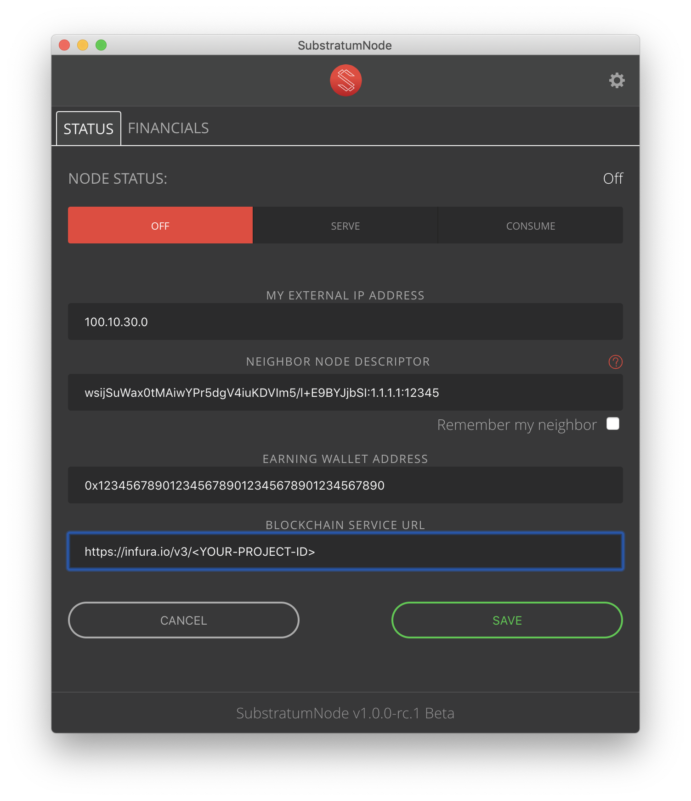

# Blockchain Service URL

### What is a blockchain service URL?

A blockchain service url is a URL that SubstratumNode uses to interact with the Ropsten testnet or Ethereum mainnet blockchains.  

To be fully functional SubstratumNode needs access to:
1. pay HOT/SUB to other nodes for routing, blockchain, and exit services consumed, 
1. determine if other requesting nodes have enough SUB to pay for services -- also ROP/ETH for gas fees, and 
1. discover payments from other nodes for routing, blockchain, and exit services provided. This keeps your node from incorrectly banning other nodes for not paying. 

There are two general types of Blockchain Services SubstratumNode currently supports.

1. Connect with a remote service that provides a JSON RPC Ethereum client like [Infura.io](https://infura.io/),
1. Run your own Ethereum miner such as a [Go Ethereum (geth)](https://geth.ethereum.org) or [Parity Ethereum](https://www.parity.io/ethereum/) JSON RPC client locally on the same machine as 
SubstratumNode or on another machine within your private network.

### 1. Sign up for a free [Infura.io](https://infura.io/register) account.
Follow the instructions here [Infura.io/docs](https://infura.io/docs) to create a "Project"
Choose one of the following options for the Ropsten testnet:
* Enter your Infura.io url `https://ropsten.infura.io/v3/<YOUR-PROJECT-ID>` in the blockchain service url field of the UI.
    
* For the command-line interface (CLI) start your SubstratumNode providing the argument 
    > `--blockchain-service-url https://ropsten.infura.io/v3/<YOUR-PROJECT-ID>`
* Edit your config.toml file and include the entry 

    > `blockservice-service-url = "https://ropsten.infura.io/v3/<YOUR-PROJECT-ID>"`

* Or define an environment variable
    * Windows
    > `set SUB_BLOCKCHAIN_SERVICE_URL = https://ropsten.infura.io/v3/<YOUR-PROJECT-ID>`
    * Linux or macOS
    > `export SUB_BLOCKCHAIN_SERVICE_URL = https://ropsten.infura.io/v3/<YOUR-PROJECT-ID>`

Change `<YOUR-PROJECT-ID>` with the PROJECT ID from your Infura.io Project Dashboard. Change the URL to 
mainnet when ready to spend and earn real SUB. NOTE: the network will initially only be testing on Ropsten. 

Soon SubstratumNode will have the ability to request clandestine blockchain services from other nodes through services like Infura.io. Requests for blockchain services will be routed just as if your 
browser sent a request to a website through the Substratum Network. In this mode your blockchain service requests will cost HOT or SUB.

### 2. Do you feel up to the technical challenge of running a full Ethereum client, keep it running, and synchronized with the blockchain?

If so, run either geth or parity and let it sync the full ethereum blockchain. 
You **do not** need to enable mining. Keeping it synchronized is sufficient. At this point CPU mining is 
not likely to earn any block rewards since GPU miners win all the rewards having the vast majority 
of the hashing power.

Be aware a fully synchronized blockchain can have considerable disk space requirements.

Enter the URL of your miner for example: http://127.0.0.1:8545/
